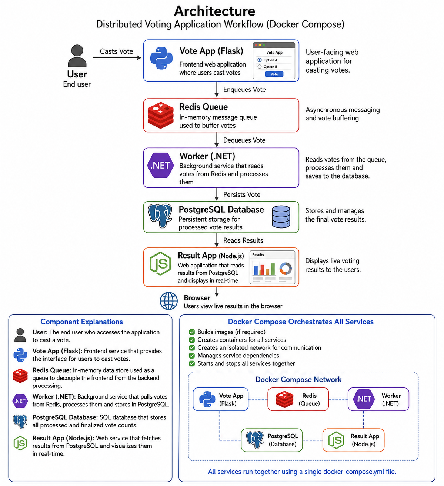

# Docker Voting App — Docker Compose Explanation

## Project Structure

```text
docker-voting-app/
│
├── vote/
│   ├── app.py
│   ├── Dockerfile
│   ├── requirements.txt
│   └── templates/
│       └── index.html
│
├── result/
│   ├── server.js
│   ├── package.json
│   ├── Dockerfile
│   └── views/
│       └── index.html
│
├── worker/
│   ├── Program.cs
│   ├── Worker.csproj
│   └── Dockerfile
│
└── docker-compose.yml
```

# Architecture




```
                User
                  │
                  ▼
          Vote App (Flask)
                  │
                  ▼
             Redis Queue
                  │
                  ▼
          Worker (.NET)
                  │
                  ▼
        PostgreSQL Database
                  │
                  ▼
        Result App (Node.js)
```

# Workflow

```
Application Source Code
        │
        ▼
Create Dockerfiles
        │
        ▼
Create docker-compose.yml
        │
        ▼
docker compose build
        │
        ▼
docker compose up
        │
        ▼
Docker Creates Network
        │
        ▼
Redis + PostgreSQL
        │
        ▼
Vote App + Worker + Result App
        │
        ▼
Application Accessible
```

---

# What is Docker Compose?

Docker Compose is used to run multiple containers together using one YAML file.

Instead of running many `docker run` commands manually, we define all services inside:

```bash
docker-compose.yml
```

Then Docker automatically:

- Builds images
- Creates containers
- Connects containers
- Creates internal network
- Starts everything together

---

# Complete docker-compose.yml

```yaml
version: "3.9"

services:

  redis:
    image: redis:alpine
    container_name: redis

  db:
    image: postgres:15
    container_name: postgres
    environment:
      POSTGRES_USER: postgres
      POSTGRES_PASSWORD: postgres
    ports:
      - "5432:5432"

  vote:
    build:
      context: ./vote
      target: final
    container_name: vote
    ports:
      - "5000:80"
    depends_on:
      - redis

  worker:
    build: ./worker
    container_name: worker
    depends_on:
      - redis
      - db

  result:
    build: ./result
    container_name: result
    ports:
      - "5001:80"
    depends_on:
      - db
```

---

# Line-by-Line Explanation

---

# 1. Version

```yaml
version: "3.9"
```

## Meaning

Defines Docker Compose file format version.

### Why 3.9?

- Modern compose version
- Supports latest Docker features
- Stable and widely used

---

# 2. Services Section

```yaml
services:
```

## Meaning

All containers are defined inside `services`.

Each service becomes one container.

In this project:
```
| Service | Purpose |
|---|---|
| redis | Stores votes temporarily |
| db | PostgreSQL database |
| vote | Frontend voting app |
| worker | Transfers votes from Redis to PostgreSQL |
| result | Shows voting results |
```
---

# 3. Redis Service

```yaml
redis:
  image: redis:alpine
  container_name: redis
```

---

## redis:

Service name.

Docker automatically creates hostname:

```text
redis
```

Other containers can connect using:

```text
redis:6379
```

---

## image: redis:alpine

Uses official Redis image from Docker Hub.

### redis

Redis database software.

### alpine

Very lightweight Linux image.

Benefits:

- Small size
- Faster download
- Faster startup

---

## container_name: redis

Gives fixed container name.

Without this Docker creates random names like:

```text
docker-voting-app-redis-1
```

With this:

```text
redis
```

---

# 4. PostgreSQL Database Service

```yaml
db:
  image: postgres:15
  container_name: postgres
```

---

## db:

Service name.

Other containers access database using hostname:

```text
db
```

---

## image: postgres:15

Uses PostgreSQL version 15.

Official image from Docker Hub.

---

## container_name: postgres

Sets container name as:

```text
postgres
```

---

# Environment Variables

```yaml
environment:
  POSTGRES_USER: postgres
  POSTGRES_PASSWORD: postgres
```

## Meaning

Used to configure PostgreSQL container.

---

## POSTGRES_USER

Creates database username.

```text
Username = postgres
```

---

## POSTGRES_PASSWORD

Creates password.

```text
Password = postgres
```

---

# Port Mapping

```yaml
ports:
  - "5432:5432"
```

## Syntax

```text
HOST_PORT:CONTAINER_PORT
```

---

## Meaning
```
| Side | Port |
|---|---|
| Host Machine | 5432 |
| PostgreSQL Container | 5432 |
```
Now PostgreSQL is accessible from:

```text
localhost:5432
```

or

```text
SERVER_IP:5432
```

---

# 5. Vote Service

```yaml
vote:
  build:
    context: ./vote
    target: final
```

---

# build

Tells Docker to build image using Dockerfile.

---

## context: ./vote

Docker build context.

Means:

```text
Use files inside vote/ folder
```

Docker looks for:

```text
vote/Dockerfile
```

---

## target: final

Used in multi-stage Dockerfiles.

Example:

```dockerfile
FROM python AS builder

# build stuff

FROM python AS final
```

Docker builds only the `final` stage.

Benefits:

- Smaller image
- More secure
- Faster

---

# Container Name

```yaml
container_name: vote
```

Container will be named:

```text
vote
```

---

# Port Mapping

```yaml
ports:
  - "5000:80"
```

## Meaning

| Host | Container |
|---|---|
| 5000 | 80 |

Open in browser:

```text
http://SERVER_IP:5000
```

Inside container app runs on port:

```text
80
```

---

# depends_on

```yaml
depends_on:
  - redis
```

## Meaning

Start Redis before Vote app.

Why?

Vote app requires Redis connection.

---

# 6. Worker Service

```yaml
worker:
  build: ./worker
  container_name: worker
```

---

# build: ./worker

Shortcut for:

```yaml
build:
  context: ./worker
```

Docker builds image using:

```text
worker/Dockerfile
```

---

# depends_on

```yaml
depends_on:
  - redis
  - db
```

## Meaning

Worker requires:

- Redis
- PostgreSQL

Docker starts them first.

---

# Worker Flow

```text
Vote App
   ↓
Redis Queue
   ↓
Worker Reads Votes
   ↓
PostgreSQL Database
```

---

# 7. Result Service

```yaml
result:
  build: ./result
  container_name: result
```

Builds Node.js result application.

---

# Port Mapping

```yaml
ports:
  - "5001:80"
```

Open:

```text
http://SERVER_IP:5001
```

---

# depends_on

```yaml
depends_on:
  - db
```

Result app needs PostgreSQL database.

---

# Docker Compose Internal Networking

Docker Compose automatically creates:

```text
Default Network
```

All containers can communicate using service names.

---

# Example Connections
```
| Service | Connects To | Hostname |
|---|---|---|
| vote | redis | redis |
| worker | redis | redis |
| worker | postgres | db |
| result | postgres | db |
```
---

# Example Redis Connection

Inside Python app:

```python
redis = Redis(host="redis", port=6379)
```

---

# Example PostgreSQL Connection

```text
Host=db
User=postgres
Password=postgres
```

---

# Build Containers

Go to project folder:

```bash
cd docker-voting-app
```

Build all images:

```bash
docker compose build
```

---

# What Happens Internally?

Docker Compose:

1. Reads compose file
2. Builds vote image
3. Builds worker image
4. Builds result image
5. Pulls Redis image
6. Pulls PostgreSQL image

---

# Start Project

```bash
docker compose up
```

---

# Detached Mode

```bash
docker compose up -d
```

## Meaning

Runs containers in background.

---

# Verify Running Containers

```bash
docker ps
```

You should see:

```text
redis
postgres
vote
worker
result
```

---

# Open Applications

## Vote App

```text
http://YOUR_SERVER_IP:5000
```

Example:

```text
http://13.233.xx.xx:5000
```

---

## Result App

```text
http://YOUR_SERVER_IP:5001
```

---

# Check Logs

---

# Vote Logs

```bash
docker logs vote
```

---

# Worker Logs

```bash
docker logs worker
```

---

# Result Logs

```bash
docker logs result
```

---

# All Logs Together

```bash
docker compose logs -f
```

## -f Meaning

Follow logs live.

Similar to:

```bash
tail -f
```

---

# Stop Containers

```bash
docker compose down
```

---

# Remove Containers + Volumes

```bash
docker compose down -v
```

---

# Restart Containers

```bash
docker compose restart
```

---

# Rebuild After Code Changes

```bash
docker compose up --build
```

---

# Useful Docker Compose Commands
```
| Command | Purpose |
|---|---|
| docker compose build | Build images |
| docker compose up | Start containers |
| docker compose up -d | Start in background |
| docker compose ps | Show running services |
| docker compose logs | View logs |
| docker compose down | Stop project |
| docker compose restart | Restart services |
```
---

# Complete Application Flow

```text
User Opens Vote App
        ↓
Vote Stored in Redis
        ↓
Worker Reads Vote
        ↓
Worker Saves Vote into PostgreSQL
        ↓
Result App Reads PostgreSQL
        ↓
Displays Results
```

---

# Architecture Diagram

```text
        +-------------+
        |   User      |
        +-------------+
               |
               v
        +-------------+
        | Vote App    |
        | Flask/Python|
        +-------------+
               |
               v
        +-------------+
        | Redis Queue |
        +-------------+
               |
               v
        +-------------+
        | Worker      |
        | .NET App    |
        +-------------+
               |
               v
        +-------------+
        | PostgreSQL  |
        +-------------+
               |
               v
        +-------------+
        | Result App  |
        | Node.js     |
        +-------------+
```

---

# Why This Project Is Important

This project teaches:

- Docker
- Docker Compose
- Multi-container apps
- Networking between containers
- Microservices architecture
- Redis
- PostgreSQL
- Python containers
- Node.js containers
- .NET containers

---

# Real DevOps Concepts Used
```
| Concept | Used Here |
|---|---|
| Containerization | Yes |
| Multi-Service Architecture | Yes |
| Internal Networking | Yes |
| Service Discovery | Yes |
| Dependency Management | Yes |
| Database Containers | Yes |
| Message Queue | Yes |
| Microservices | Yes |
```
---

# Final Notes

This is one of the most famous Docker practice projects.

You can later extend it with:

- Kubernetes
- Jenkins CI/CD
- Docker Hub
- AWS ECS
- Monitoring
- Nginx
- HTTPS
- Scaling
